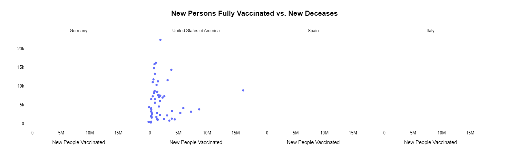
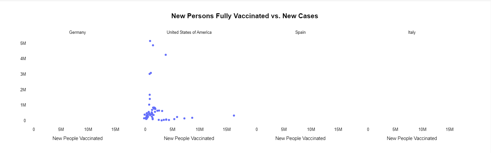

# ETL Process and Execution Guide

## ETL Process Overview

The ETL (Extract-Transform-Load) pipeline in this project processes multiple data sources, cleans, and integrates them into a single aggregated table. Here's how the process is structured:

### 1. Extraction
Data is extracted from the input folder provided by the user. Only the relevant files are processed:

- demographics
- epidemiology
- health
- hospitalizations
- index
- vaccinations

Each file is read into a Pandas DataFrame and stored in a dictionary for further processing.

### 2. Transformation
Data is cleaned, formatted, and transformed using the following steps:

- **Column Selection**: Extract only the required columns for each dataset. (We kept columns that were relevant or that don not than 50% of values missing, since they might not be providing enough valuable information for our analysis.)
- **Location Key Transformation**: Keep only the first two letters of the location_key for simplicity of the future aggregation (country code).
- **Duplicate and Null Removal**: Remove duplicate rows and completely empty rows.
- **Handling Missing Data**:
  - Fill population-related columns (population, etc.) with the median value grouped by location_key.
  - Fill case-related columns (new_confirmed, new_deceased, etc.) with 0 under the assumption that NaN means no reported cases.
- **Date Handling**: Convert date columns to datetime format and add a week column that groups data by weeks (e.g., 2022-01-03/2022-01-09).
- **Filtering**: Filter the data for a user-specified date range and a list of countries.

### 3. Aggregation
Data is aggregated at the weekly and country level:

- Weekly sums for `new_confirmed`, `new_deceased`, `new_hospitalized_patients`, and `new_persons_fully_vaccinated`.
- Weekly or country-level means for other columns like `life_expectancy`.

### 4. Joining
The individual tables (epidemiology, hospitalizations, vaccinations, health, demographics, index) are joined to produce a single "macro table" that combines all the information.

### 5. Exporting
The final table is exported as a CSV file named `macrotable.csv` to the specified output directory.

## Instructions to Execute the ETL Script

### 1. Setup Requirements
Ensure you have Python 3.12 installed and that it is available in your system's PATH.

Install the required libraries by running the following command:

```bash
pip install pandas
```

### 2. Run the Script
The script accepts command-line arguments for the input directory, output directory, date range, and countries.

To execute the script, run the following command in your terminal:

```bash
python etl.py <path_to_input_folder> -o <output_folder> -s <start_date> -e <end_date> -c <country1> <country2> ...
```

- Replace `<path_to_input_folder>` with the path to the folder containing the input CSV files. **You can find the files in the folder "data" inside this zip file.**
- Replace `<output_folder>` with the directory where the final `macrotable.csv` will be saved.

### Optional arguments:
- `-o` or `--output`: The directory where the final `macrotable.csv` will be saved (optional). If not specified, the script will save it in the current working directory.
- `-s` or `--start`: Start date for filtering data (default: `2020-01-02`).
- `-e` or `--end`: End date for filtering data (default: `2022-08-22`).
- `-c` or `--countries`: A space-separated list of countries to include in the analysis (e.g., "USA Germany Italy").

### 3. Example Command
```bash
python etl.py ./data -o ./output -s 2020-01-01 -e 2021-04-30 -c United States of America Germany Italy
```

This command will:

- Read CSV files from the `./data` folder.
- Filter data between `2021-01-01` and `2021-12-31`.
- Include only the countries `USA`, `Germany`, and `Italy`.
- Export the resulting aggregated table as `macrotable.csv` in the `./output` folder.

## File Structure:
- `etl.py`: The main script containing the ETL pipeline.
- `data/`: Directory containing input CSV files.
- `output/`: Directory where the final processed CSV can be saved (optional). If not specified, the file will be saved in the current working directory.

## Notes:
- Ensure the input folder contains the correct CSV files (`demographics`, `epidemiology`, `health`, `hospitalizations`, `index`, and `vaccinations`).
- If the output directory is not specified, the script saves the output file in the current working directory.

## Exploratory Data Analysis (EDA)

In this section, we performed an Exploratory Data Analysis (EDA) on the dataset to uncover key insights related to COVID-19 cases, deaths, and vaccination trends across different countries. The analysis aimed to identify patterns and correlations that could inform decisions regarding pandemic management and resource allocation.


### Key Insights from EDA

1. **Population Ratios (Older vs. Younger)**
   - Countries like **Germany**, **Spain**, and **Italy** have a higher proportion of older populations (over 60 years) compared to younger populations (under 19 years), which makes them more vulnerable to higher COVID-19 mortality rates.
   
2. **Male vs. Female Ratio**
   - The gender distribution across the countries is nearly equal, with a slightly higher proportion of females. Gender might not have a significant impact on COVID-19 mortality or case trends in the countries analyzed.

3. **Evolution of New Cases (Grouped by Country)**
   - The number of new COVID-19 cases showed significant peaks around **January 2021** and **January 2022**, indicating periods of high transmission. Healthcare systems should be prepared for such surges.

4. **Evolution of Deaths (Grouped by Country)**
   - Mortality rates peaked at **April 2020**, **January 2021**, and **January 2022**, with a declining trend in more recent months. This suggests that improvements in healthcare and treatment are mitigating COVID-19 deaths, though periodic spikes still require attention.

5. **New Cases and Deaths by Country**
   - The **USA** experienced much larger peaks in both new cases and deaths compared to other countries, likely due to its larger population. This highlights the need for scalable healthcare infrastructure, especially in densely populated countries.

6. **Mortality Rate Over Time by Country**
   - A general decline in mortality rates over time was observed across all countries, although there were several notable peaks. These peaks highlight the importance of responding quickly to sudden increases in COVID-19 cases.

7. **Cases per Million by Country**
   - Trends in cases per million showed synchronized peaks across all countries, suggesting that global patterns in COVID-19 waves could be anticipated. This is useful for predicting future surges and preparing for them.

8. **Vaccination Impact on New Cases and Deaths**
   - The scatter plots revealed that lower vaccination rates were associated with higher numbers of new cases and deaths. Vaccination efforts are crucial for reducing both infection and mortality rates.





### Conclusions

- **Older populations** are more vulnerable to severe COVID-19 outcomes, especially in countries with a higher proportion of elderly individuals.
- Healthcare systems must be **prepared for surges**, particularly during known peak periods (e.g., January 2021, January 2022).
- **Vaccination** has a direct impact on reducing new cases and deaths, emphasizing the importance of ongoing vaccination campaigns.
- The trends in **cases per million** show that COVID-19 surges occur globally at similar times, which could help in anticipating and managing future outbreaks.


